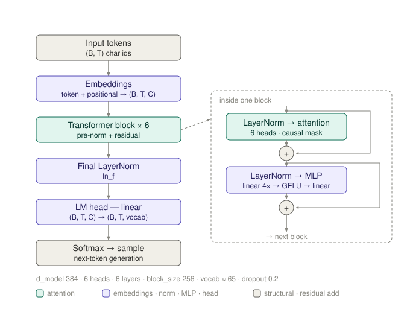

# GPT-from-scratch — a character-level GPT built line by line

A decoder-only transformer (GPT) implemented **from scratch in PyTorch** and trained to generate Shakespeare-style text at the character level. Every component — attention, LayerNorm, the transformer block, the training loop, and autoregressive generation — is written by hand to understand *why* the architecture is shaped the way it is, not just how to call it.

> Trained on the ~1MB tiny-Shakespeare corpus. Character-level tokenizer (vocab ≈ 65). No external transformer libraries used for the model itself.

## Results

Training loss fell from initialization at ≈ `ln(vocab_size)` (uniform-guessing baseline) to ~1.1 over 2.5k steps:

| step | 0 | 500 | 1000 | 1500 | 2000 | 2500 |
|---|---|---|---|---|---|---|
| loss | 4.29 | 1.79 | 1.47 | 1.32 | 1.22 | 1.12 |

Sample generation (untrained → gibberish; trained → learns the *form* of a play):

```
YORK: Richard will be lack to be her body age. Still you that art barded her wick, God? ...
HERMIONE: Will you are almost against up the king?
LUCIO: To charact that ...
```

Semantically it's nonsense — it's a tiny model — but starting from characters alone it induced words, capitalization, apostrophes, line breaks, and the `CHARACTER:` dialogue format.

## Architecture

Standard decoder-only GPT:
<p align="center">
  
</p>

- **Token + learned positional embeddings**, summed → `(B, T, C)`.
- **N stacked transformer blocks**, each = causal multi-head self-attention + position-wise MLP, **pre-norm** with residual connections.
- **Final LayerNorm** → **LM head** (linear → vocab logits).
- Loss: cross-entropy on next-token prediction at every position.

Default config: `d_model=384`, `6` heads, `6` layers, `block_size=256`, `batch=64`.

## Design notes (the *why* behind the choices)

- **Character-level tokenizer.** Tiny vocab (~65) → a clean sanity check that initial loss ≈ `ln(65) ≈ 4.17` (uniform prior), and you can *watch* the model learn structure from raw characters. At scale you'd switch to BPE — attention is O(T²), so shorter subword sequences win — but for a learning project char-level's simplicity dominates.
- **Causal masked attention.** Self-attention is permutation-invariant, so positional embeddings inject order. The causal mask blocks each position from attending to future tokens — which is what makes training on *all* positions at once valid (no position can peek at its own target). Remove the mask and the next-token loss collapses to ~0 while learning nothing.
- **Pre-norm, not post-norm.** LayerNorm is applied to each sublayer's *input* (`x = x + sublayer(LN(x))`), leaving the residual stream an unnormalized identity path from input to output. That clean path keeps gradients stable at depth (no per-layer LayerNorm rescaling compounding), so training is stable without heavy learning-rate warmup. The one final `ln_f` before the head normalizes the accumulated residual stream once.
- **Numerically stable softmax.** Subtract the row max before exponentiating; with `-inf` masking, the causal mask guarantees every row keeps at least its diagonal entry, so there's never a fully-masked row to produce NaNs.
- **Generation crops context to `block_size`.** The positional-embedding table has exactly `block_size` rows, so the generated sequence must be cropped to the last `block_size` tokens each step — otherwise the position lookup overflows the table. Sampling uses `multinomial` (not greedy `argmax`) for diversity; temperature would sit between the two.
- **AdamW.** Per-parameter adaptive rates (via the second moment) suit the varied gradient scales in a transformer; decoupled weight decay keeps regularization consistent instead of being distorted by the adaptive scaling.

## What I learned / debugging notes

First generation came out as pure noise despite a trained model. Rather than tweak the generation code, I isolated model-vs-code with a one-line loss check, confirmed the generate function was correct, and traced it to a re-initialized model instance — a notebook cell-order bug. Fixing execution order fixed the output.

## Run

```bash
pip install -r requirements.txt
python train.py      # trains, prints loss, saves the model
python generate.py   # samples text from the trained model
```

## Roadmap

Next: extend toward post-training — a reward model, then DPO, then PPO/GRPO — to explore RLHF end-to-end.

---
*Built by Yunchao Xu as a from-scratch study of transformer internals.*
